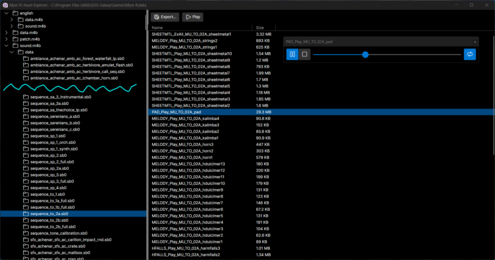

# Myst IV Asset Explorer

Browse and extract Myst IV game assets, and play audio assets in-app with gapless looping in a high-performance app built with [.NET 8](https://dotnet.microsoft.com/en-us/) and [Avalonia UI](https://avaloniaui.net/).

## How to use

Make sure Myst IV is installed somewhere under your `Program Files (x86)` directory (or on a 32-bit operating system, `Program Files`). Myst IV Asset Explorer will autodetect the path to the `data\*.m4b` files.

Download and run the .exe file from the latest release of Myst IV Asset Explorer from <https://github.com/jnm2/MystIVAssetExplorer/releases> and run it. If .NET 8 or newer is not installed, the app will take you to the download page for .NET 8.

## Audio

To explore the audio for the game, expand the `sound.m4b/data` folder and click on various `.sb0` files which define the audio streams for the game. For language-specific audio files, expand the top-level language folder and its contained `sound.m4b/data`.

Myst IV stores audio in three audio formats: uncompressed PCM, a proprietary Ubisoft format based on IMA ADPCM, and Ogg Vorbis. All three can be played back and exported. The ADPCM format is converted to uncompressed PCM (*.wav) before exporting.

The game's music is contained in `mu_music.sb0`, `music_personality_test.sb0`, and the `sequence_*.sp0` files. See [Music not included in the soundtrack](#music-not-included-in-the-soundtrack) and [Soundtrack music and variants](#soundtrack-music-and-variants) for overviews of the music in the game.

## Video

The game's video is contained in .bik files. These use the [Bink Video](https://en.wikipedia.org/wiki/Bink_Video) format. The video files contain no audio.

To view the video files, they can be exported and played with [ffmpeg (ffplay)](https://ffmpeg.org/ffplay.html) or [VLC](https://www.videolan.org/vlc/). You can also preview them from the app by double-clicking or clicking Play, if ffmpeg or VLC are installed on your system.

## Music not included in the soundtrack

- Dream sequence (Peter Gabriel): `mu_music.sb0` stream 1
  - A different version was released 15 years later as <https://petergabriel.bandcamp.com/track/curtains>
- Same thing, but instrumental (used for credits?): `sequence_sa_3_instrumental.sb0` stream `Instrumental_MU_SA_03_PG_Instrumental`
- Tomahna: `sequence_to_2b_full.sb0` stream `FULL_Play_MU_TO_02B_FULL`
- Spire: `sequence_sp_2a.sb0` stream 47
- Haven: `sequence_hn_1d_full.sb0` stream `FULL_Play_MU_HN_01D_full`
- Serenia "personality test" vocals: `music_personality_test.sb0` streams 0-5
- Cyan logo tune: `logo_cyan.sb0`
- Intro video audio, speech on top of the Main Theme track (the menu background music): `<language>/sound.m4b/data/<language>/video_w6_stream.sb0` stream 7
- Others?

## Soundtrack music and variants

The official game soundtrack can be streamed from a few places:

- <https://open.spotify.com/album/6ZbbGQubzXHkZlIVawPUxl>
- <https://music.youtube.com/playlist?list=OLAK5uy_k1Hi0PhoDFAspaPYcIhhCUILfpsmomqoE>
- <https://music.amazon.com/albums/B0BKCHXS9G>

For entries denoted with `†`, the file is language-specific and is found in the `<language>/sound.m4b/data/<language>` folder.

| Soundtrack title                        | `sound.m4b/data` file          | Stream                                             |
|-----------------------------------------|--------------------------------|----------------------------------------------------|
| 1. Main Theme (4:29)                    | `mu_music.sb0`                 | 0 (4:29)                                           |
| 2. Yeesha's Joyride (1:03)              | ?                              | ?                                                  |
| 3. Enter Tomahna (6:37)                 | `sequence_to_1a_full.sb0`      | `FULL_play_MU_TO_01A_full` (3:13, part 1)          |
|                                         | `sequence_to_1b_full.sb0`      | `FULL_play_MU_TO_01B_full` (3:31, part 2)          |
| 4. Darkness (2:59)                      | `sequence_to_2a.sb0`           | `PAD_Play_MU_TO_02A_pad` (2:53), with dozens of other short sounds from the same `.sb0` file overlaid—also, the _game_ asset is oddly present in the first 25 seconds of <https://cosmosis.bandcamp.com/track/spanish-gypsy>?? |
| 5. Achenar's Prelude (0:13)             | `video_w4_stream.sb0`†         | 258 (0:13, has game sounds over it)                |
|                                         | `video_w1_stream.sb0`†         | 87 (0:15, similar, has game sounds over it)        |
| 6. Jungle Landing (3:40)                | ?                              | ?                                                  |
|                                         | `sequence_hn_1a_full.sb0`      | `FULL_Play_MU_HN_01A_full` (3:14, part 2)          |
|                                         | `sequence_hn_1_full.sb0`       | `FULL_Play_MU_HN_01_full` (3:08, part 2 alternate) |
| 7. The Swamp (2:25)                     | `sequence_hn_1b_full.sb0`      | `FULL_Play_MU_HN_01B_full` (3:38)                  |
| 8. The Predator (3:59)                  | `sequence_hn_1c_full.sb0`      | `FULL_Play_MU_HN_01C_full` (4:20)                  |
|                                         | `sequence_hn_1c_instr.sb0`     | `INSTR_Play_MU_HN_01C_instr` (4:17, alternate)     |
| 9. Lakeside (2:36)                      | `sequence_hn_2_full.sb0`       | `FULLSEQ_Play_MU_HN_02_full` (2:34)                |
| 10. Achenar Meeting (1:53)              | `video_w4_stream.sb0`†         | 222 (1:56, has speech over it)                     |
| 11. Welcome (3:00)                      | `sequence_hn_3_full.sb0`       | `FULL_Play_MU_HN_03_full` (2:57)                   |
| 12. Enter Spire (3:30)                  | `sequence_sp_1.sb0`            | `FULLSEQ_Play_MU_SP_01_full` (3:28)                |
|                                         | `sequence_sp_1_synth.sb0`      | `FULLSEQ_MU_SP_01_synth` (3:28, alternate)         |
|                                         | `sequence_sp_1_orch.sb0`       | `FULLSEQ_MU_SP_01_orch` (2:47, alternate)          |
| 13. Prison Level (4:56)                 | `sequence_sp_2_full.sb0`       | `FULL_Play_MU_SP_02_full` (4:54)                   |
| 14. Sirrus Defends/Sirrus' rage (2:31)  | `video_w4_stream.sb0`†         | 234 (1:30, part 1, has speech over it)             |
|                                         | `video_w3_stream.sb0`†         | 22 (1:05, part 2, has speech over it)              |
| 15. Nearest Island (2:52)               | `sequence_sp_3_full.sb0`       | `FULL_Play_MU_SP_03_full` (3:08)                   |
| 16. Leaving Spire (1:00)                | ?                              | ?                                                  |
| 17. Enter Serenia (3:11)                | `sequence_sa_1_full.sb0`       | `FULL_Play_MU_SA_01_full` (3:10)                   |
|                                         | `sequence_sa_1_instrument.sb0` | `INSTRUMENT_Play_MU_SA_01_instr` (3:10, alternate) |
| 18. The Monastery (2:12)                | `sequence_sa_2_full.sb0`       | `FULL_Play_MU_SA_02_full` (2:10)                   |
| 19. Dream (0:59)                        | `sequence_sa_3a.sb0`           | `CHOIR_Play_MU_SA_03A_choir1` (0:28, part 1)       |
|                                         | `sequence_sa_3a.sb0`           | `CHOIR_Play_MU_SA_03A_choir2` (0:40, part 2)       |
| 20. Hall of Spirits (2:32)              | `sequence_sa_2_full.sb0`       | `FULL_Play_MU_SA_02A_full` (2:30)                  |
| 21. The Serenians (2:04)                | `sequence_serenians_a.sb0`     | `CHOIR_Play_MU_SERENIANS_A` (0:46, part 1)         |
|                                         | `sequence_serenians_b.sb0`     | `CHOIR_Play_MU_SERENIANS_B` (0:47, part 2)         |
|                                         | `sequence_serenians_c.sb0`     | `CHOIR_Play_MU_SERENIANS_C` (0:44, part 3)         |
| 22. The Revelation/The Sacrifice (2:24) | ?                              | ?                                                  |
| 23. End Game (2:07)                     | `video_w4_stream.sb0`†         | 232 (2:05, has alternate ending 1 speech over it)  |
|                                         | `video_w4_stream.sb0`†         | 233 (2:05, has alternate ending 2 speech over it)  |
| 24. Atrus' speech (1:45)                | `video_w1_stream.sb0`†         | 65 (1:43, has speech over it)                      |
